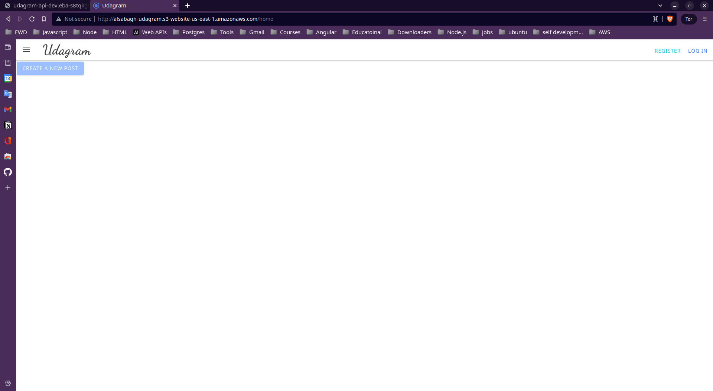

# Udagram
**Udagram** is one of **Udacity**'s project to practice deployment process, I took a newly developed full stack application and deployed it to **AWS** so that it is available to customers. This application contains the main components of a 3-tier full stack application (UI, API, and Database).

- [Final Link](http://alsabagh-udagram.s3-website-us-east-1.amazonaws.com)

> Please note the link will be broken right after Udacity submission approval

### did the following:

- Configured the services and infrastructure on AWS
- Created scripts to deploy each component of the application
- Created and documented an automated pipeline using CircleCI

## infrastructure diagram

---

# Documentations

- ## [Infrastructure description](docs/Infrastructure%20description.md)

- ## [App dependencies](docs/app%20dep.md)

- ## [DB Deployment](docs/DB_deploy.md)

- ## [UI Deployment](docs/uI-deploy.md)

- ## [Backend Deployment](docs/BE-deploy.md)

- ## [CI/CD](docs/ci.md)

- ## [Pipelibe Process](docs/pipeline%20process.md)
