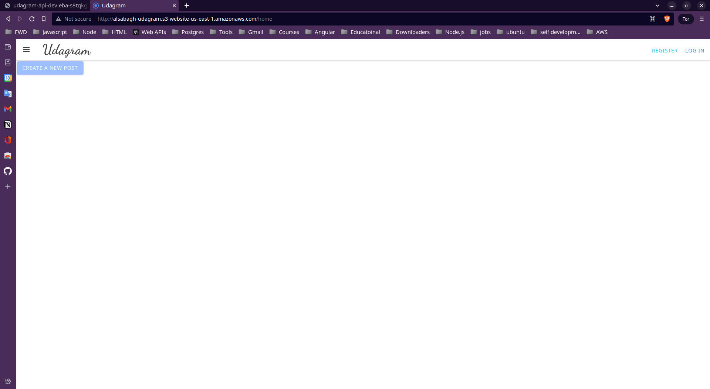
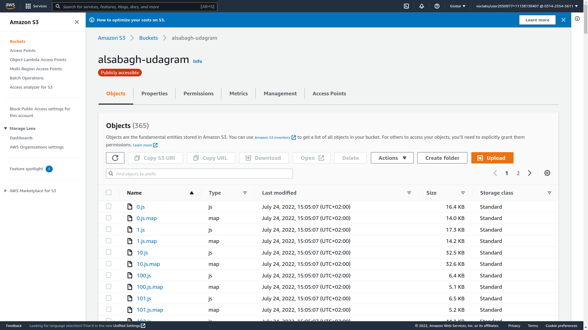
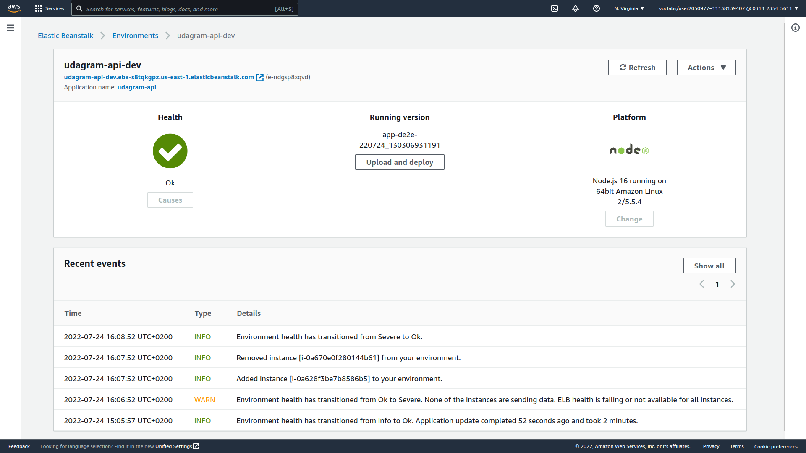
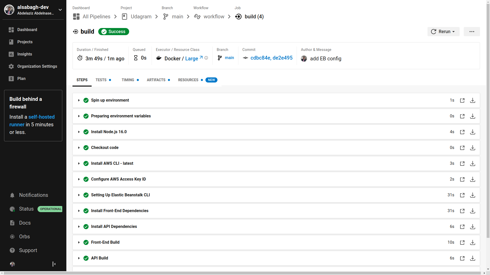

# Udagram
**Udagram** is one of **Udacity**'s project to practice deployment process, I took a newly developed full stack application and deployed it to **AWS** so that it is available to customers. This application contains the main components of a 3-tier full stack application (UI, API, and Database).

- [Final Link](http://alsabagh-udagram.s3-website-us-east-1.amazonaws.com/home)



> Please note the link will be broken right after Udacity submission approval

### did the following:

- Configured the services and infrastructure on AWS
- Created scripts to deployed each component of the application
- Created and documented an automated pipeline using CircleCI

# DB Deployment
This project uses PostgresDB, deployed it using **AWS** **RDS**
## Guide to deploy db to RDS
1. In **AWS** console search for **RDS**
2. Choose *Create database* button
3. Choose 'Standard create' > 'PostgreSQL' > 'Free tier'
4. Put database name and password
5. make sure to choose `public access` for the sake of this project
6. Click Create database button

> Make sure to whitelist back-end IP

### My DB 


# UI Deployment
For deploying the frontend, I used **AWS S3** *static website hosting*
## Guide to deploy frontend to S3
01. In **AWS** console search for **S3**
02. Click on the Create bucket button. It will launch a new wizard.
03. Provide the bucket-name and the region where you want to locate the bucket.
04. Under public access settings, uncheck the Block all public access option
    > Make sure to check ✅ I acknowledge that the current settings might result in the his bucket and the objects within becoming public
05. Disable Bucket Versioning *for the sake of this project*
06. Click Create bucket
07. After creation choose the bucket 
08. Choose 'Permission' tab
09. In 'Bucket policy' section choose 'Edit'
10. Add bucket policy 
```
{
    "Version": "2012-10-17",
    "Statement": [
        {
            "Sid": "PublicReadGetObject",
            "Effect": "Allow",
            "Principal": "*",
            "Action": [
                "s3:GetObject"
            ],
            "Resource": [
                "arn:aws:s3:::BUCKETNAME/*"
            ]
        }
    ]
}
```
 
> Make sure change `BUCKETNAME` to your bucket name and save changes

11. Now go to 'Properties' tab
12. In 'Static website hosting' section choose *Edit*
13. choose **Enable**, **Host a static website*, and provide index document e.g. `index.html`  
14. Save changes.

## To upload files to your bucket use:
```aws s3 cp --recursive  ./www s3://BUCKETNAME/```

## My Bucket


# Backend Deployment
I Used **AWS Elastic Beanstalk** to host the backend

## Guide to Use EB
1. open your termainal 
2. change directory to your backend project
3. initialize the app using **eb init**

    ``` eb init app-name --platform node.js --region us-east-1```

4. create an environment **eb create**

    ```eb create --sample env-name```

5. In AWS console search for Elastic Beanstalk
6. in Elastic Beanstalk  Envirments you will find your enviroment
7. choose it 
8. in the left panal under you environment name choose **configuration**
9. Edit **Software** Category to add `environment variables`
10. to deploy your code use:

    ``` eb use environment-name```

    and 

    ```eb deploy```

## My EB env


# CI/CD
For this project I used [CricleCI.com](https://circleci.com/) as CI provider.

## simple guide
1. create `.cricleci` directory uder you root dir

    > root dir refers to the root directory of the repo that contains both Frontend and backend prjects

2. add scripts to your root `package.json` to excute sub packages scripts e.g. frontend:install

3. add `config.yml` file

```
version: 2.1
orbs:
  # orgs contain basc recipes and reproducible actions (install node, aws, etc.)
  node: circleci/node@5.0.2
  
jobs:
  # different jobs are calles later in the workflows sections
    #job name
    build:
         # Prepare the image ro run the job sequance
         # the base image can run most needed actions with orbs
         docker:
            - image: "cimg/node:16.0"
         steps: 
         # install node and checkout code
            - node/install:
                node-version: '16.0'
            - checkout
        
            # use run to add the instructions/commands
            - run:
                name:       step name
                command:    npm run cmd
            # you can use as many runs
# You can also use Work flows
```

4. commit your changes to Github
5. create account on CircleCI and link it to Github
6. in CircleCI choose your repo and choose the config.yml file 
7. by default on every commit, CricleCI will trigger the pipeline to start and redeploy your projects

## My Pipeline

My pipeline does the following:
- install frontend
- install backend
- build frontend
- build backend
- deploy frontend
- deploy backend

## My CircleCI


