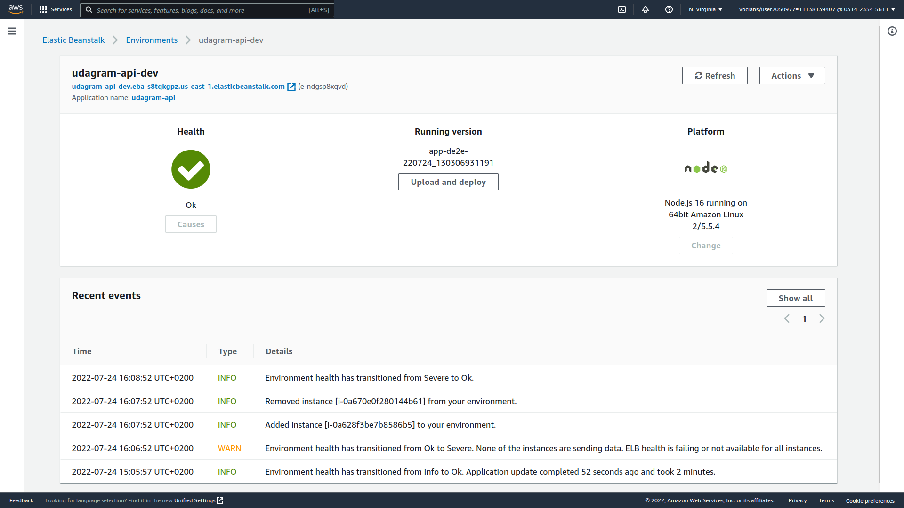

# Backend Deployment
I Used **AWS Elastic Beanstalk** to host the backend

## Guide to Use EB
1. open your termainal 
2. change directory to your backend project
3. initialize the app using **eb init**

    ``` eb init app-name --platform node.js --region us-east-1```

4. create an environment **eb create**

    ```eb create --sample env-name```

5. In AWS console search for Elastic Beanstalk
6. in Elastic Beanstalk  Envirments you will find your enviroment
7. choose it 
8. in the left panal under you environment name choose **configuration**
9. Edit **Software** Category to add `environment variables`
10. to deploy your code use:

    ``` eb use environment-name```

    and 

    ```eb deploy```

## My EB env
