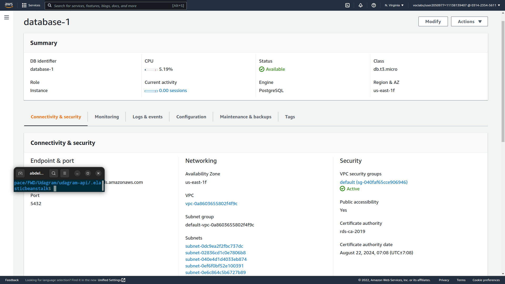

# DB Deployment
This project uses PostgresDB, deployed it using **AWS** **RDS**
## Guide to deploy db to RDS
1. In **AWS** console search for **RDS**
2. Choose *Create database* button
3. Choose 'Standard create' > 'PostgreSQL' > 'Free tier'
4. Put database name and password
5. make sure to choose `public access` for the sake of this project
6. Click Create database button

> Make sure to whitelist back-end IP

### My DB 
