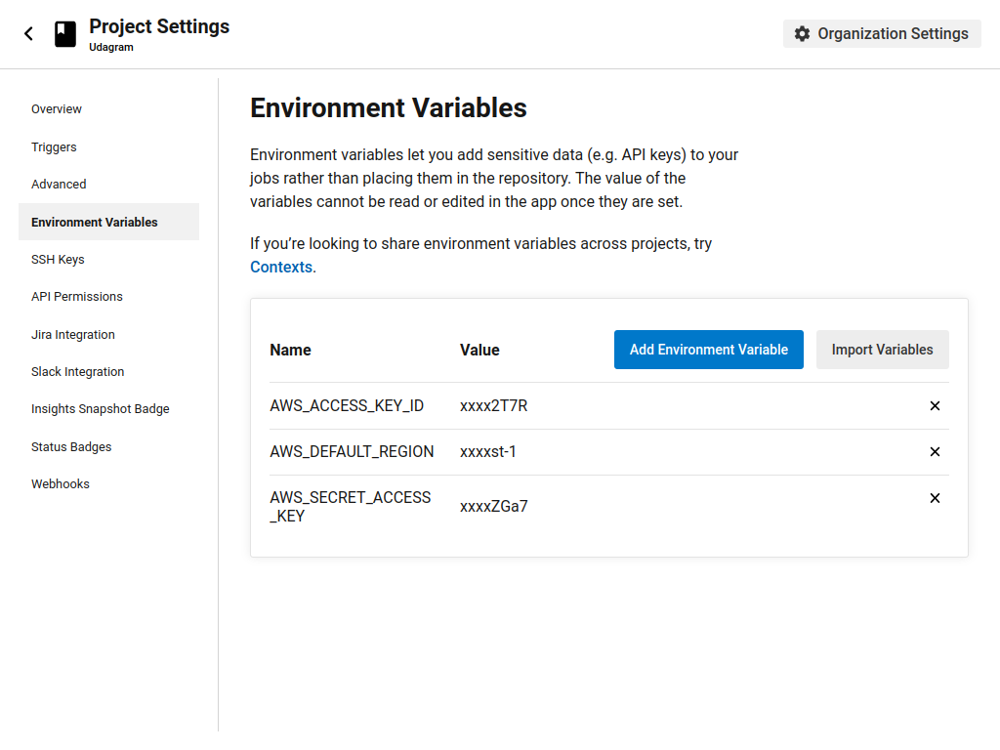
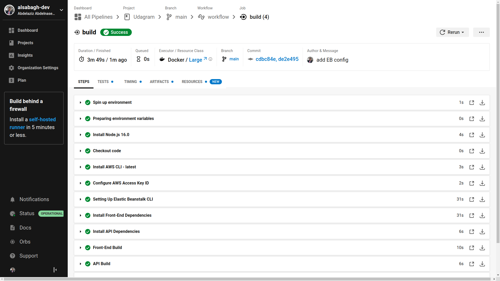

# CI/CD
For this project I used [CricleCI.com](https://circleci.com/) as CI provider.

## simple guide
1. create `.cricleci` directory uder you root dir

    > root dir refers to the root directory of the repo that contains both Frontend and backend prjects

2. add scripts to your root `package.json` to excute sub packages scripts e.g. frontend:install

3. add `config.yml` file

```
version: 2.1
orbs:
  # orgs contain basc recipes and reproducible actions (install node, aws, etc.)
  node: circleci/node@5.0.2
  
jobs:
  # different jobs are calles later in the workflows sections
    #job name
    build:
         # Prepare the image ro run the job sequance
         # the base image can run most needed actions with orbs
         docker:
            - image: "cimg/node:16.0"
         steps: 
         # install node and checkout code
            - node/install:
                node-version: '16.0'
            - checkout
        
            # use run to add the instructions/commands
            - run:
                name:       step name
                command:    npm run cmd
            # you can use as many runs
# You can also use Work flows
```

4. commit your changes to Github
5. create account on CircleCI and link it to Github
6. in CircleCI choose your repo and choose the config.yml file 
7. by default on every commit, CricleCI will trigger the pipeline to start and redeploy your projects

8. choose **Prject settings** to add **AWS** keys

## My Configuration


## My Pipeline

My pipeline does the following:
- install frontend
- install backend
- build frontend
- build backend
- deploy frontend
- deploy backend

## My CircleCI


