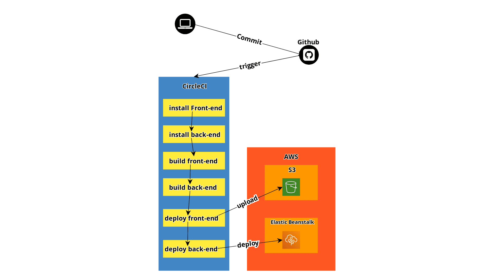

# Pipelibe Process

this  pipeline does the following:
- install frontend
    > install front-end packages and dependancies
- install backend
    > install backend-end packages and dependancies
- build frontend
- build backend
- deploy frontend
    > upload static files to S3
- deploy backend
    > deploy the updated backend code
    