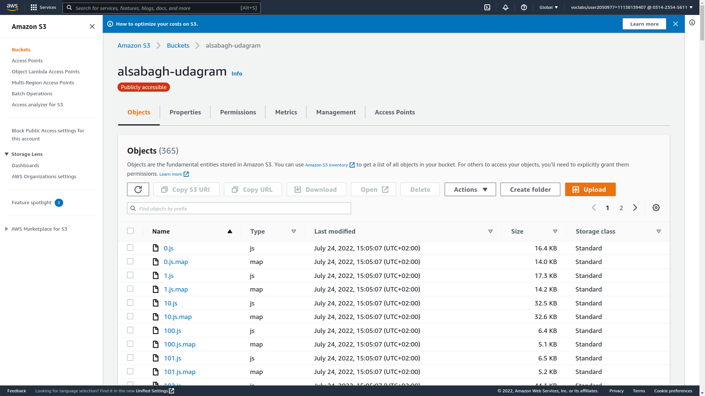

# UI Deployment
For deploying the frontend, I used **AWS S3** *static website hosting*
## Guide to deploy frontend to S3
01. In **AWS** console search for **S3**
02. Click on the Create bucket button. It will launch a new wizard.
03. Provide the bucket-name and the region where you want to locate the bucket.
04. Under public access settings, uncheck the Block all public access option
    > Make sure to check ✅ I acknowledge that the current settings might result in the his bucket and the objects within becoming public
05. Disable Bucket Versioning *for the sake of this project*
06. Click Create bucket
07. After creation choose the bucket 
08. Choose 'Permission' tab
09. In 'Bucket policy' section choose 'Edit'
10. Add bucket policy 
```
{
    "Version": "2012-10-17",
    "Statement": [
        {
            "Sid": "PublicReadGetObject",
            "Effect": "Allow",
            "Principal": "*",
            "Action": [
                "s3:GetObject"
            ],
            "Resource": [
                "arn:aws:s3:::BUCKETNAME/*"
            ]
        }
    ]
}
```
 
> Make sure change `BUCKETNAME` to your bucket name and save changes

11. Now go to 'Properties' tab
12. In 'Static website hosting' section choose *Edit*
13. choose **Enable**, **Host a static website*, and provide index document e.g. `index.html`  
14. Save changes.

## To upload files to your bucket use:
```aws s3 cp --recursive  ./www s3://BUCKETNAME/```

## My Bucket

